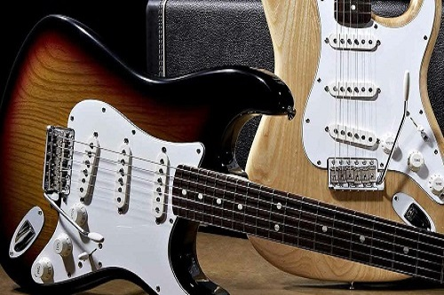
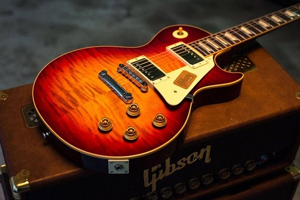
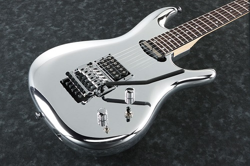
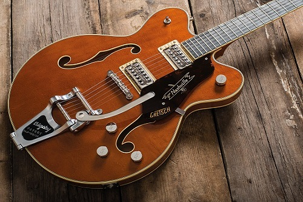
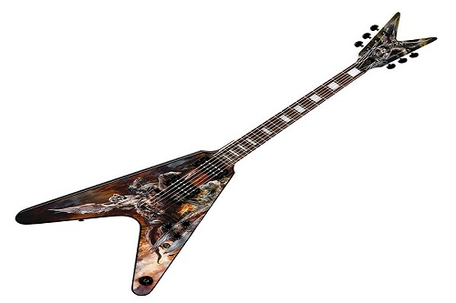

# Guitarras Eléctricas
##  Guitarras  emblemáticas
Top 5  guitarra s  emblemáticas

1. Fender Stratocasrter [enlace en linea](https://es.wikipedia.org/wiki/Fender_Stratocaster)
2. Gibson Les Paul [enlace en linea](https://es.wikipedia.org/wiki/Gibson_Les_Paul)
3. Ibanez [enlace en linea](https://es.wikipedia.org/wiki/Ibanez)
4. Gretsch [enlace en linea](https://es.wikipedia.org/wiki/Gretsch)
5. Dean  [enlace en linea](https://es.wikipedia.org/wiki/Dean_Guitars)

>*“Quiero hacer una música tan perfecta que se filtre a través del cuerpo y sea capaz de curar cualquier enfermedad”. - **Jimmy Hendrix***

  [enlace en linea](https://shop.fender.com/es-ES/start)

  [enlace en linea](https://www.gibson.com/)

  [enlace en linea](https://www.ibanez.com/eu/)

  [enlace en linea](https://www.gretschguitars.com/)

  [enlace en linea](https://www.deanguitars.com/)

### Cógigo de lenguaje JAVA

`public class guitarras{`  
`public static void main( Strings args [ ] { )`  
`System.out.print("Bienvenid@ al  mundo de las guitarras eléctricas");`  
`  }`  
`}`

#### Enlace a la página referencias.md  
[aquí]: https://github.com/Oriol-web/Oriol-web.github.io/blob/main/referencias.md

Más información pulse [aquí]
